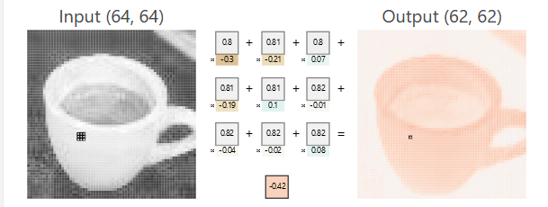

# A Visual Exploration of Convolutional Neural Networks (CNNs)

For this report I used the following two links to explore the deeper functionality of a CNN. 

- https://www.cs.ryerson.ca/~aharley/vis/conv/

- https://poloclub.github.io/cnn-explainer/

To start off my understanding of CNNs was fuzzy at best. I understood that a kernel was a sliding window with a set of parameters. I understood that at every neuron in a convolutional layer, the kernel would slide across the pixels of the image (assuming of course the input was an image) and do some operation on the pixels, which would lead to a new image. And I knew there was downsampling (and upsampling, where applicable) involved. Beyond this I did not understand the details.

Exploring both links  offered a much deeper insight. Both visualize the process of convolution and it is really cool to actually see the output images after every step of the convolution. First of all, I understood a little bit about convolution actually did to the image. I assumed that early layers of an image classifier CNN would only spot simple features such as edges. This assumption was confirmed by the results of the first convolutional layer highlighting mainly edges of the image for example the image below.

It was really interesting to realize that a convolution was not magic, but simply the dot product of the pixel values in the image and the weights in the kernel with a bias added. This made clear exactly which weights were being trained and how altering these weights shifted the result of the convolution. It also made sense that because the later layers use a couple of selected neurons from the previous layer as inputs, that the features detected would quickly grow in complexity. When inspecting the later layers, the outputs were no longer interpretable to me as they are an amalgamation of multiple input neurons.

Downsampling through maxpool was easy enough to understand and I could clearly see why it was used in this scenario. As we are simply doing classification and we don't need to reconstruct the image, we don't care too much about preserving size. Rather we just want to downsize the image so that it less computationally intensive to run through the CNN.

Finally I understood the classification step quite clearly. First the outputs from the final round of convolutions and downscaling get flattened. A fully connected layer (which has to be fully connected since we need information about every final output) is used to calculate the likelihood of each image belonging to a particular category. Softmax has to be used here as the last step to generate this likelihood. I assume softmax is ideal here since we only want to predict one category. The category with the highest result at the end is ofcourse the predicted category.

I learned a lot from this exploration, the inner workings of a CNN were made lot more clear, and I have visual insight into previously abstract concepts of convolution, downsample and image classification.

  